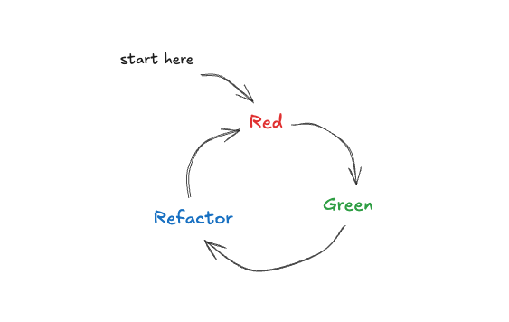
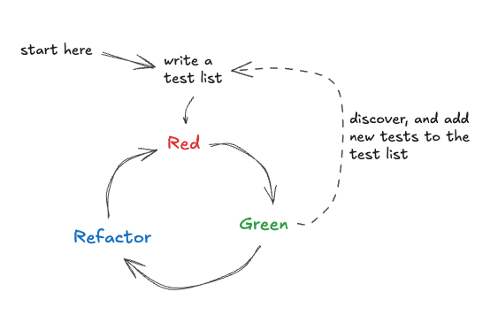

# Basics of TDD

**Learning goal**: Learn the basics of TDD, pair programming and/or ensemble programming.

## Step 1, if possible - install [mob.sh](https://mob.sh/)

Having a tool like _mob.sh_ makes switching the 'driver', or 'typist' swiftly, regardless if working onsite, or remote.
In this session, mob.sh is a recommended tool

# TDD

Often TDD is described as the following loop.



In this exercise, we try to follow the so-called [Canon-TDD](https://tidyfirst.substack.com/p/canon-tdd). In that, one
important change for the often descried TDD is that we _don't just start writing the first test_, but there is an 
important step before going into the loop. The often forgotten first step is to _think_ of the behaviour change we're
about to introduce to the code. This is an _analysis_. The importance of this step is, that when all the tests (the list
of tests is about to change during the implementation phase) are marked as done, you know you are finished.

.

Today we'll practice this.

# Step 2 **Implement a scheduler algorithm**

**Background**: We'll be programming a tool for conference organisers. One of the tasks for the organisers is to select
a set of talks/workshops for people to attend to. A talk/workshop has a time, and a title (also some other important
aspects, but we can omit those for now). And a conference has a set of 'slots'. A slot is basically a time span of 
X minutes. A conference typically has certain amount of longer sessions, some shorter sessions and possibly some even
shorter sessions. In this example, we'll implement an algorithm that lists the available slots for the conference.

**TASK**: Test-Drive an algorithm to give you list of available slot durations from a set of available session slots.

1. Implement a method (in a class or not, you choose), that matches the following shape.
   ``` typescript
    fill(availableTime: number): number[]
   ```
... where
- **available time** (in minutes) is how many minutes still needs to be filled with sessions.

... and where you have
- Fixed **session durations** with **maximum allowed counts**

| *Duration (in min)* | *Max Count* |
|---------------------|-------------|
| 90                  | 2           |
| 60                  | 4           |
| 30                  | 6           | 
| 15                  | 6           |            

2. With these details, implement and test the method `fill`

**Notes**

- Session durations may be reused only up to their maximum count
- The algorithm does not need to find an optimal solution
- Focus on correctness, readability, and clear logic

**Acceptance Criteria**

- returns a list of session durations that fills the 'availableTime'.
- Prefer **longer sessions first** (greedy approach)
- Never exceed the maximum count for any session type
- Return an array of session durations whose sum is **≤ totalTime**
- Exact fill is preferred but **not guaranteed**.
- The function is tested.

**Examples** (but not full test list):

- 90 -> [90]
- 180 -> [90, 90]
- 105 -> [90, 15]
- 110 → [90, 15] (’losing 5 mins’)


## Finished?

🎉 Done! 🎉