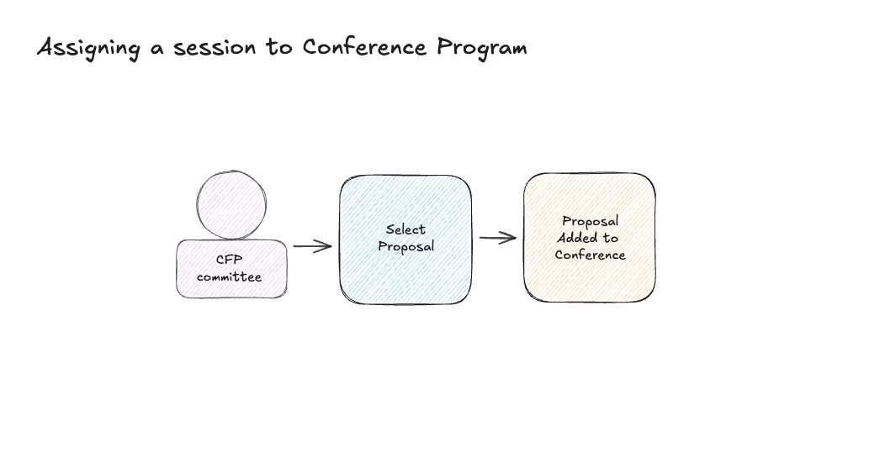
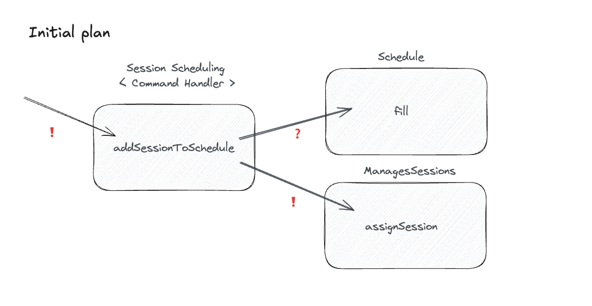
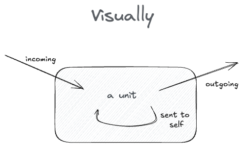

# How to test anything

**Learning goal**: A simple model that shows how to test anything.

**Background info**: This is designed to be used with objects and object-oriented code - but the learnings 
are similar in functional languages, too. Just some steps might be a bit _weird_. So if possible, use Classes and 
Objects on this exercise, if you choose to.

**Problem**: As conference organizer, you want to assign proposals to a conference program.



To do this, you need to implement a handler for the 'Select Proposal' command, a class `SessionScheduling`. The handler's 
responsibility is to take a session information, and assign the session to conference program.



We will implement 2 parts of this, the `Schedule` which returns available session lenghts for the conference, and then 
the `SessionScheduling` which will use two collaborators to implement the handler logic.

The domain is meant to be easy - you can assume the following:
- you can only pass valid data, 
  - no negative numbers, 
  - no 0, no null, etc.
- when handling time, it's always in minutes.
  - no need to add a concept of 'time'

This time, we have a very specific learning goal and that is **not** about finding all the corner cases etc.

## Session Briefing

While testing the 2 classes, we'll learn the model by Sandi Metz on 'How to test any unit' 

**Before we start**: Answer to the following questions?
- What is difference between a Query and a Command?
- Why does it matter? Why is it important to separate them?

Let's build a 2-by-3 matrix like this:

```
          \  Type +-------------+-------------+
              \   |    Query    |   Command   |
          Origin \+=============+=============+
                  |             |             |
     incoming     |             |             |
                  |             |             |
                  +-------------+-------------+
                  |             |             |
     sent to self |             |             |
                  |             |             |
                  +-------------+-------------+
                  |             |             |
     outgoing     |             |             |
                  |             |             |
                  +-------------+-------------+
```

The message has 2 types: 'Query' and 'Command', while the message origin has 3 options: 
'incoming', 'sent to self' or 'outgoing'. We'll define these later.



## Ready to start?
[Step 1](./step1.md)
