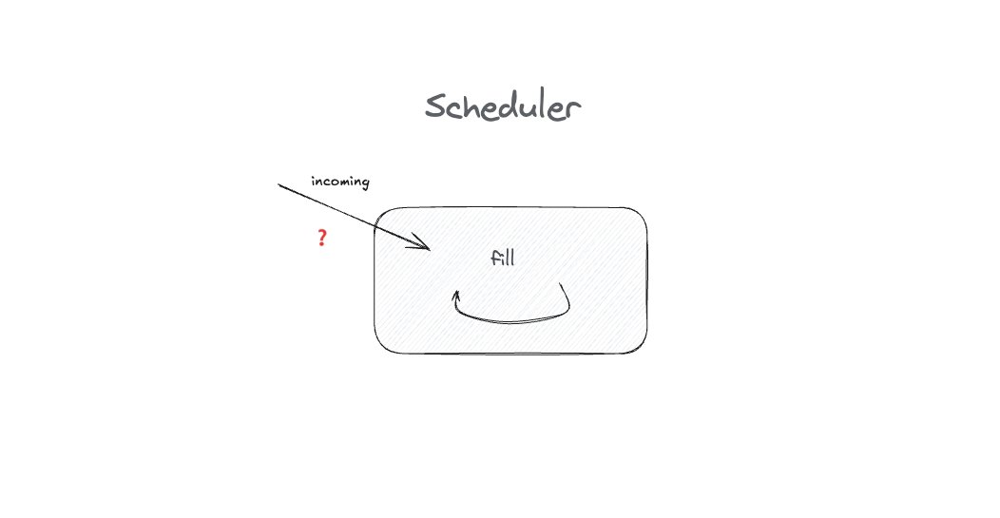

# How to test anything

[..go back](./README.md)

**Learning goal**: What is an incoming message - how to test an Incoming Query?

## Step 1 **Add tests for the scheduler algorithm**

**TASK**: Test the `AvailabilityScheduler#fill` method

Add unit tests for the `fill` method.

**Notes**

- the `fill` method is an incoming query.

- You do **not** need to touch the implementation.
- Think about the coverage for tests. 

**Acceptance Criteria:**

- The code is tested.

**Example Code**:

example code you'll find in each language folder.
- [for Javascript](./javascript/step1.md)

## Finished?

[Step 2](./step2.md)