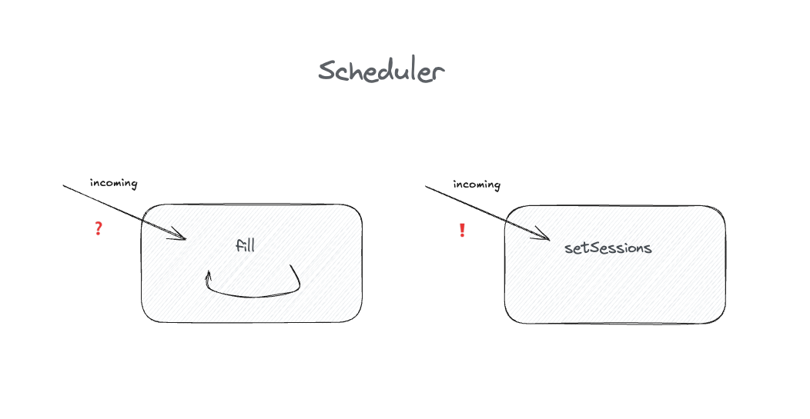

# How to test anything

[..go back](./step1.md)

## Step 2 **Make the Scheduler Configurable**

**Task**: Make available slots modifiable 

1. Extend your `AvailabilityScheduler` class by adding a method:
``` typescript
setSessions(slots: Array<{duration: number, max: number}>):void {
   this.slots = slots
}
```

... where 
 - **slots** is an array of new session slots.

2. This method should **replace the current session durations and max counts** with the ones provided.
3. Plan how you will test the `setSessions` method, and **test it**.

**Notes**

- Now we're introducing a command that has a clear side-effect (changes the internal data)

- You do **not** need to change `fill` method — just make sure it uses the new sessions.
- Think the way(s) this can be tested! What of (any) would you choose and why?

**Acceptance Criteria:**

- The code is tested.

**Examples**

One possible way of using the new Scheduler in tests.

``` javascript
   const scheduler = new Scheduler();
   
   // Set custom sessions
   scheduler.setSessions([
     { duration: 45, max: 3 },
     { duration: 20, max: 5 },
     { duration: 10, max: 10 }
   ]);
   
   // Verify something.
```

## How to test private methods?


well, **we don't**

## Finished?

[Step 3](./step3.md)
