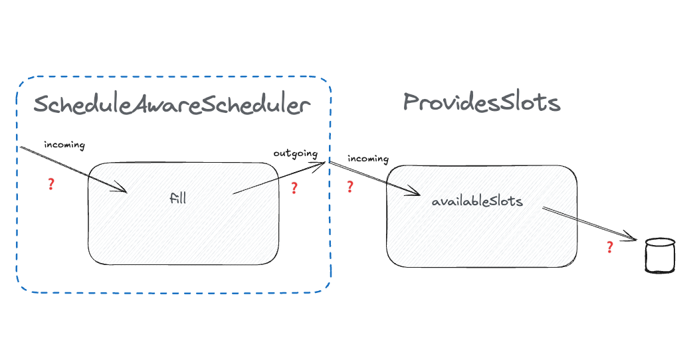

# How to test anything

[..go back](./step2.md)

## Step 3 **Load Sessions Dynamically**

**Task**: Implement a new Scheduler class that **loads session options from an external source**:



For this to work, introduce a new class.

1. Define an interface* `ProvidesAvailableSlots` with a method:
```typescript
    interface ProvidesAvailableSlots {
      availableSlots(): Array<{ duration: number, max: number }>;
    }
```
    
2. Test that the scheduler correctly uses sessions from the external source. 
```typescript
export class ScheduleAwareAvailabilityScheduler {
   #providesSlots: ProvidesAvailableSlots
   
   constructor(providesSlots: ProvidesAvailableSlots) {
      this.#providesSlots = providesSlots
   }
   
   // ... rest omitted
}
```

**Notes**

The goal is to **decouple session definitions** from the scheduler logic.

- You should be able to inject any class that matches the shape of `ProvidesAvailableSlots` and the scheduler still works.
- You can use stubs, fakes or make your own little object matching the Shape. You know, Duck Typing!
- `fill()` should behave exactly as before but now use the sessions provided dynamically.

**Acceptance Criteria:**

- The Scheduler is tested.
- The tests do not use a production class ProvidesAvailableSlots

**Example Code**:

example code you'll find in each language folder.
- [for Javascript](./javascript/step3.md)

**Questions**: 
- Q: Is new `ScheduleAwareAvailabilityScheduler#fill` pure function? Why it would matter?
- A: By definition, a function is pure if it always returns the same output for the same input, and it has no side-effects.
Hence, If `ProvidesAvailableSlots#availableSlots` always returns the same value, and does not have side-effect, then
`AvailabilityScheduler#fill` is indeed a pure function

- Q: Why should I not test the `ProvidesAvailableSlots`? Does that remain untested?
- A: An outgoing query (towards a collaborator) is an incoming query (from the collaborator's point of view).
(See the blue boundaries on the image) We'll test that collaborator using the same heuristics we're building here. 
So, trust the interfaces, trust the shape and contract. For more volatile contracts, we can also add some extra testing,
like contract tests, but that's another story. 

\* if working with dynamically typed languages like JavaScript, Ruby, Python (and TypeScript), you can think an interface
being a _shape_ or a _protocol_. I often think classes as _playing a role_, where the _shape of the role_ is the messages
the class knows how to respond to. It might seem very abstract, but that's what it is - a shape is an abstract construct,
but it does indeed represent what an object is. **Something that responds to a message as agreed by the protocol**
## Finished?

[Step 4](./step4.md)    