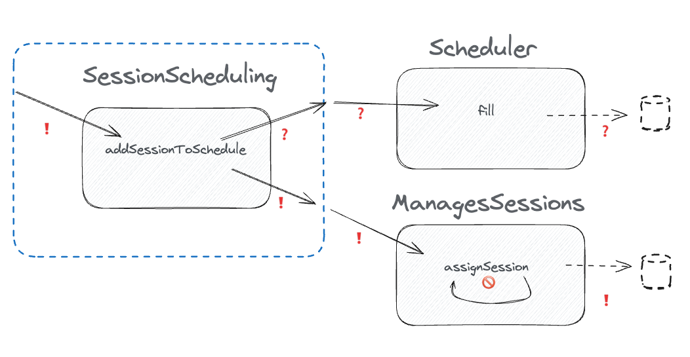

# How to test anything

[..go back](./step2.md)

## Step 4 **Implement the command handler logic**

**Task**: Now as the Scheduler implementation is working, we can implement the command handler logic that was the
programming goal of this exercise. 

The function `addSessionToSchedule`, it queries the available slot lenghts from `Scheduler` shape, and then, if there
is a room for the session, it sends a command `assignSession` to a collaborator that plays the role of `ManagesSessions`

**Notes:**

- The example code exists in the `step4.md` of the respective language folder
- The goal is to test the `addSessionToSchedule` function.

Hint: you know already how to test outgoing query.

**Acceptance Criteria:**

- The SessionScheduling is tested.
- The tests do not use a production class ConferenceSessionManaging

**Example Code**:

example code you'll find in each language folder.
- [for Javascript](./javascript/step4.md)

## Finished?

🎉 Done! 🎉 
