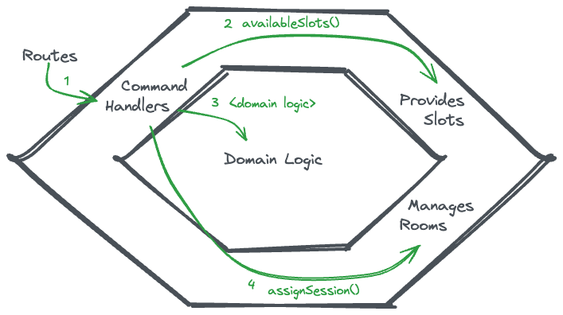

# How to test anything

[..go back](./step2.md)

## Step 5 **(Optional) I/O to the boundary**

**Task**: Modify the existing code

<div class="wrapper">
<span class="show-label">Show example Code:</span>
<input type="checkbox" id="nav-trigger" class="nav-trigger toggleCheckbox">
<label for="nav-trigger" class="toggleContainer">
    <div>&nbsp;&nbsp;&nbsp;</div><div>&nbsp;&nbsp;&nbsp;&nbsp;</div>
</label><div class="content">
       
   ```typescript
        // Collaborator: manages actual session assignment
        interface ManagesRooms {
          assignSession(sessionInfo: {title: string, duration: number}, slotDuration: number)
        }

        interface ProvidesAvailableSlots {
            availableSlots(): Array<{ duration: number, max: number }>;
        }

        interface Scheduler {
            // This is what we did already
        	fill( totalTime: number) : number[]
        }

        class SlotProviderAwareScheduler implements Scheduler {
            constructor(providesSlots) {
                this.providesSlots = providesSlots;
            }
        
            fill(totalTime) {
                const result = [];
                let remaining = totalTime;
        
                for (const session of this.providesSlots.availableSlots()) {
                    let used = 0;
                    while (remaining >= session.duration && used < session.max) {
                        result.push(session.duration);
                        remaining -= session.duration;
                        used++;
                    }
                }
        
                return result;
            }
        }
        
        // New class: SessionPlanner
        export class SessionPlanner {
          constructor(scheduler, roomManager, totalTime) {
            this.scheduler = scheduler;
            this.roomManager = roomManager;
            this.totalTime = totalTime;
          }
        
          planSession(sessionInfo) {
            // This hides part of the domain logic, together with I/O
            const availableSlots = this.scheduler.fill(this.totalTime);
        
            // This is also part of the domain logic
            const slot = this.domainLogic(availableSlots, sessionInfo)
        
            if (slot) {
              // I/O happens here, too
              this.roomManager.assignSession(sessionInfo, slot);
            } else {
        	    const msg = `No available slot for session "${sessionInfo.title}" (${sessionInfo.duration} min)`
                console.log(msg)
                throw new Error(msg)
            }
          }
            
          domainLogic(availableSlots, sessionInfo) {
              return availableSlots.sort((a, b) => a - b).find(
                  (duration) => duration >= sessionInfo.duration
              );
          }
        }
   ```
    
</div>
</div>

**Task**: Practice Functional Core / Imperative Shell.

Also known as 'I/O to the boundary' and 'Onion Architecture' and very close to 'Hexagonal Design'

The core of this is to make sure all the I/O happens at the boundaries, and all the domain logic
functions are pure functions. Figure out first where's the problematic part? What part of the 
domain logic is not actually pure (if we expect that available slots are retrieved from DB). 

1. Find out where the logic hides I/O that is not happening at the boundary (but in domain logic)
2. What is the core domain logic? Where does it lie?
2. Move the I/O to boundary, expand Domain logic to accept all input data from the outside.
    ```javascript
    async function ioAtBoundary() {
        // read data - I/O at incoming boundary
        var inputData = await getInputData()
        // call pure function
        var result = pureDomainLogicLivesHere(inputData)
        // I/O happens at boundary too
        saveDataToDB(result)
    }
    ```
3. Write all the necessary tests.

**Notes**:

Originally, the code does not have a clear separation of concerns, in what is responsible or I/O operations
and what is domain logic. The core domain logic is in 2 classes (which is totally fine) - in `AvailabilityScheduler` and
in `SessionPlanning`. I'd argue that the core domain logic is to 'find which session types are still available and fit 
the given session into the available slots'. The unfortunate part is that the first part of the logic is implemented
within pure functions, because I/O operation is hidden inside `AvailabilityScheduler` (as seen in the picture below). 
The said I/O operation is to fetch the data from DB.


The problematic part is this:
```typescript
        class SlotProviderAwareScheduler implements Scheduler {
            fill(totalTime) {
                // [...]
                for (const session of this.providesSlots.availableSlots()) {
                // [...]
                }
            }
            // ... rest omitted
        }
```

because it reads data inside the domain functionality. To fix the situation, Do provide another version of `fill` that 
takes also the sessions as parameter (and then make this fill method to use that before removing all usages). 
Write tests for the new function, and in the end remove the old version of 'fill' -> and then remove the dependency to 
`ProvidesSlots` from the class.

Then (re)write tests for the SessionPlanner .

**Acceptance Criteria**:

Code respects I/O to the boundary or 'functional core/imperative shell' approach

## Finished?

🎉 Done! 🎉


## What did we learn? 

When a code like this is seen, one way to deal with this would be to move the logic of `ProvidesSlots` outside from the 
`AvailabilityScheduler` and only pass the values to that. That way, the domain logic can be pure. 


Other benefit of this is to have clearer responsibilities of Hexagonal architecture, where the `SessionPlanning` turns
out to be a sort of _command handler_, and as command handler, it does orchestrate the logic by first getting all the 
data, then calling the domain logic, and in the end, performing necessary I/O operations at the other end of the logic.

This can be seen in the next picture:



Some benefits of having clear separation of I/O from domain logic is that this makes domain logic very easy to test, 
and to be less likely to fail. Also the _Command Handler_ logic becomes unsurprising, if it always works the same: 
- Get Data from Providers
- Do Domain logic transformations
- Update the result somehow somewhere.

<style>
.nav-trigger {
    position: absolute;
    clip: rect(0, 0, 0, 0);
}

.nav-trigger:not(:checked) ~ .content {
    display: none;
}

.nav-trigger:checked ~ .content {
    display: -ms-flexbox;
    display: block;
}

.toggleCheckbox {
    display: none;
}

.toggleContainer {
    position: relative;
    display: grid;
    grid-template-columns: repeat(2, 1fr);
    width: fit-content;
    border: 3px solid #343434;
    border-radius: 20px;
    background: #343434;
    font-weight: bold;
    color: #343434;
    cursor: pointer;
}

.toggleContainer::before {
    content: '';
    position: absolute;
    width: 50%;
    height: 100%;
    left: 50%;
    border-radius:20px;
    background: white;
    transition: all 0.3s;
}
.toggleContainer div {
    padding: 6px;
    text-align: center;
    z-index: 1;
}
.toggleCheckbox:checked + .toggleContainer::before {
    left: 0%;
}
.toggleCheckbox:checked + .toggleContainer div:first-child{
    color: white;
    transition: color 0.3s;
}
.toggleCheckbox:checked + .toggleContainer div:last-child{
    color: #343434;
    transition: color 0.3s;
}
.toggleCheckbox + .toggleContainer div:first-child{
    color: #343434;
    transition: color 0.3s;
}
.toggleCheckbox + .toggleContainer div:last-child{
    color: white;
    transition: color 0.3s;
}

</style>